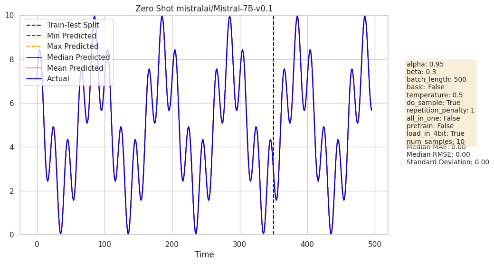
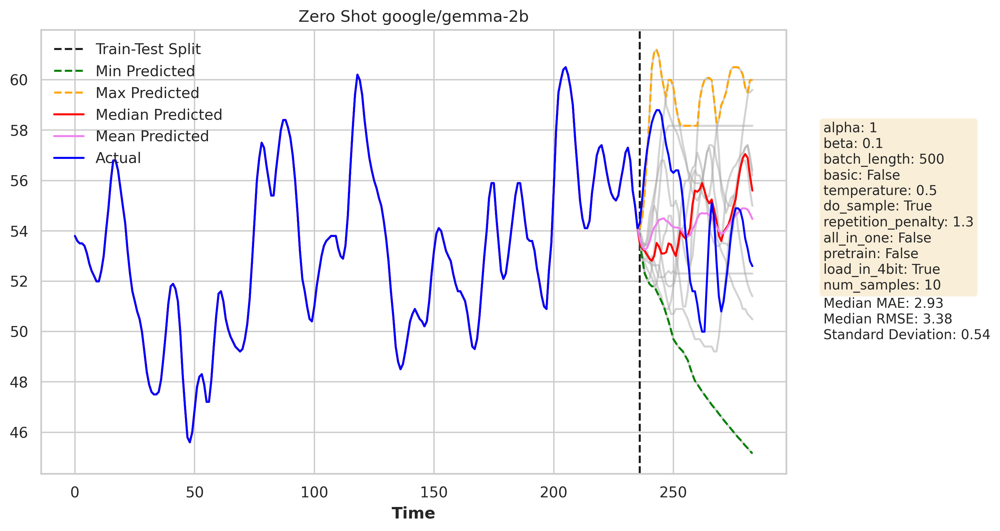

# Time Series Forecasting Using Large Language Models

Time series forecasting plays a crucial role across a wide range of domains, from finance and healthcare to climate science and industrial production. This project explores a novel approach to time series forecasting using Large Language Models (LLMs). By harnessing the power of LLMs' next-token prediction capabilities, we aim to simplify the forecasting process and improve accuracy for diverse time series datasets.

LLMs have emerged as powerful tools for modelling sequential data thanks to their ability to capture complex patterns and distributions. Pretrained on vast and diverse datasets, LLMs inherently grasp intricate temporal dependencies and exhibit biases favouring simplicity and repetition. Leveraging their transformer architecture, we aim to push the boundaries of traditional forecasting methods and uncover insights for effective prediction in various real-world applications.

## Code Structure

The code is structured as follows:

- `zero_shot.ipynb`: Contains the implementation of Zero Shot Time Series Forecasting in which we can plug in any model from HuggingFace from choice. 

- `few-shot.ipynb`: Contains the implementation of Few Shot learning using Langchain on any model from HuggingFace. 

- `few-shot-outlines.ipynb`: Contains the implementation of Few Shot learning using structured output using Outlines library on any model from HuggingFace.

The inputs of the LLMTime Class are as follows:

- `train`: The training data for the time series forecasting.
- `test`: The test data for the time series forecasting.
- `alpha`: A parameter used in the get_scaler method. Default value is 0.95.
- `beta`: A parameter used in the get_scaler method. Default value is 0.3.
- `batch_length`: The length of the batch used in few-shot learning. Default value is 400.
- `basic`: A boolean parameter used in the get_scaler method. Default value is False.
- `temperature`: The temperature parameter used in the HuggingFace model. Default value is 0.5.
- `do_sample`: A boolean parameter used in the HuggingFace model. Default value is True.
- `model_name`: The name of the HuggingFace model to be used. Default value is "mistralai/Mistral-7B-v0.1".
- `repetition_penalty`: The repetition penalty parameter used in the HuggingFace model. Default value is 1.0.
- `load_in_4bit`: Option to use quantizied models. Default value is True.
- `num_samples`: Number of samples to be taken. Defaults to 10.

## Results

Some of the results obtained are as follows:

Sine + Cosine Function:

Gas Rate CO2 Dataset (Multivariate):

Further plots can be found in the `zero_shot_results` and `few_shot_results` directory.  
Baseline results can be found in the `lstm_results` and `arima_results` directory.  

Datasets used for testing can be found in `datasets.ipynb`. Further code for obtaining baseline LSTM results can be found in `lstm.ipynb`.

## Collaboration and License

We welcome collaboration and contributions from the community to enhance our project. Feel free to fork and submit pull requests to improve the codebase or suggest new features. This project is licensed under the terms of the [MIT License](LICENSE), ensuring openness and accessibility to all.

## References

1. "Large Language Models Are Zero-Shot Time Series Forecasters Paper by NYU" [Link](https://arxiv.org/abs/2310.07820)
2. "Zero-Shot Time Series Forecasting using Transformers - Moment MOMENT: A Family of Open Time-Series Foundation Models (CMU)" [Link](https://arxiv.org/abs/2402.03885)
3. "Lag-Llama: Towards Foundation Models for Probabilistic Time Series Forecasting" [Link](https://arxiv.org/html/2310.08278v3#:~:text=By%20applying%20a%20decomposition%20technique,%2C%202005%3B%20Hyndman%20%26%20Athanasopoulos%2C)
