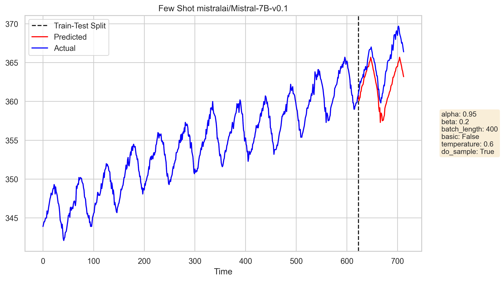

# Air Quality Forecasting using Large Language Models

**Author:** Shubh Agarwal - 21110205

## Problem Definition

The project aims to utilize large language models for air quality forecasting, specifically leveraging the next-token prediction capabilities of Large Language Models for time series forecasting.

## Preliminary Literature

1. **Large Language Models Are Zero-Shot Time Series Forecasters Paper by NYU:** The paper discusses the use of large language models for time series forecasting, specifically focusing on next token prediction for time series forecasting.
2. **Zero-Shot Time Series Forecasting using Transformers - Moment MOMENT: A Family of Open Time-Series Foundation Models (CMU):** The paper discusses the use of transformers for time series forecasting, specifically focusing on the Moment MOMENT framework.
3. **Lag-Llama: Towards Foundation Models for Probabilistic Time Series Forecasting:** The paper presents Lag-Llama, a foundation model for univariate probabilistic time series forecasting based on a decoder-only transformer architecture that uses lags as covariates.

## Code Structure

The code is structured as follows:

- `llmtime.ipynb`: Contains the implementation of LLMTime model using LLMs including LLama2 and Mistral-7B-v0.1. 
- `few-shot.ipynb`: Contains the implementation of Few Shot learning using Langchain on Mistral-7B-v0.1, Mistral-7B-Instruct-v0.2 and Mixtral-8x7B-Instruct-v0.1. Documentation for the LLMTime class initialization in few-shot.ipynb:

The LLMTime class in `few-shot.ipynb` is used for time series forecasting using large language models, specifically utilizing the next-token prediction capabilities of Large Language Models. The class is initialized with the following parameters:

- `train`: The training data for the time series forecasting.
- `test`: The test data for the time series forecasting.
- `alpha`: A parameter used in the get_scaler method. Default value is 0.95.
- `beta`: A parameter used in the get_scaler method. Default value is 0.3.
- `batch_length`: The length of the batch used in few-shot learning. Default value is 400.
- `basic`: A boolean parameter used in the get_scaler method. Default value is False.
- `temperature`: The temperature parameter used in the HuggingFace model. Default value is 0.5.
- `do_sample`: A boolean parameter used in the HuggingFace model. Default value is True.
- `model_name`: The name of the HuggingFace model to be used. Default value is "mistralai/Mistral-7B-v0.1".
- `repetition_penalty`: The repetition penalty parameter used in the HuggingFace model. Default value is 1.0.

The class has the following methods:

- `get_scaler`: A static method used to get the scaler for the data.
- `convert_array_to_string`: A method used to convert an array to a string.
- `preprocess_data`: A method used to preprocess the data.
- `few_shot`: A method used to perform few-shot learning.

## Results

Some of the preliminary results obtained are as follows:

Simle Sine Function:

Mauna Loa CO2:

These were some promising results, but further analysis is required to validate the performance of the models.
Further plots can be found in the `plots` directory.

## References

1. "Large Language Models Are Zero-Shot Time Series Forecasters Paper by NYU" [Link](https://arxiv.org/abs/2310.07820)
2. "Zero-Shot Time Series Forecasting using Transformers - Moment MOMENT: A Family of Open Time-Series Foundation Models (CMU)" [Link](https://arxiv.org/abs/2402.03885)
3. "Lag-Llama: Towards Foundation Models for Probabilistic Time Series Forecasting" [Link](https://arxiv.org/html/2310.08278v3#:~:text=By%20applying%20a%20decomposition%20technique,%2C%202005%3B%20Hyndman%20%26%20Athanasopoulos%2C)
